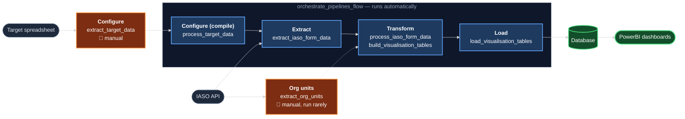

# RISP Niger — Multi-campaign

OpenHEXA pipelines that track Niger's vaccination campaigns (polio, rougeole, méningite, TCV,
fièvre jaune, albendazole, vitamine A) for the Ministry of Health. They pull submissions from an
IASO form filled out by health workers, reconcile them against target figures and the health-facility
org-unit tree, and load the result into an OpenHEXA database that feeds a PowerBI dashboard for
live KPI tracking (Couverture, Complétude, Stocks, Surveillance, Communications, Comparaison des
rounds).

## Table of contents

- [How the pieces fit together](#how-the-pieces-fit-together)
- [Configuring a campaign](#configuring-a-campaign)
- [Repository structure](#repository-structure)
- [Getting started](#getting-started)
- [Running a pipeline locally](#running-a-pipeline-locally)
- [Testing](#testing)
- [Deployment](#deployment)
- [Keeping shared code in sync](#keeping-shared-code-in-sync)
- [Where to go next](#where-to-go-next)

## How the pieces fit together

The architecture follows a five-stage ETL shape: **Configure → Extract → Transform → Load**, with
one **Orchestrate** pipeline chaining the automated stages together.



🟠 **Configure** is one of two manual, human-triggered steps: someone uploads a target
spreadsheet and runs `extract_target_data`, which saves that run's own target/expected-structure
rows as per-run files (it does not compile the combined datasets itself — see below). 🟠
**Org units** (`extract_org_units`) is the other manual step, run rarely and on its own — the
IASO org-unit tree changes only occasionally (health-facility openings/closures/renames), while
the pipeline itself is comparatively memory- and time-consuming, so it's deliberately excluded
from the automated chain rather than re-run on every orchestration; every downstream step still
reads whichever org-unit tree was last extracted, however long ago that was. 🔵 **Configure
(compile) → Extract → Transform → Load** run automatically, chained by
`orchestrate_pipelines_flow`: `process_target_data` compiles `combined_target_data.parquet` /
`expected_data_structure.parquet` from every per-run file produced so far, first in the chain,
since Transform depends on both being up to date. 🟢 The result lands in the database that feeds
the dashboards.

`process_target_data` reuses the name of an earlier, different pipeline (the one that became
`extract_target_data` once compiling was split out of it) — same name, unrelated code, deployed
as a distinct pipeline in OpenHEXA. See `CLAUDE.md`'s pipeline list for the full history.

## Configuring a campaign

Configuring a campaign (historical or new) is always the same two steps:

1. **Run `extract_target_data`** (manual). Upload the target spreadsheet as **Fichier de cibles
   (.xlsx)**, pick the **Type de campagne**, **Année de la campagne** and one or more **Numéro(s)
   de round**. If that exact `(année, produit, round)` combination isn't in the historical
   date-lookup table, **Date de début/de fin de la campagne** become required too. The pipeline
   matches the spreadsheet's rows to org units, builds the matching expected-data-structure rows,
   and saves both as **per-run files** — it never touches the combined datasets itself.
2. **Run `process_target_data`** (automated — the first step of `orchestrate_pipelines_flow`, so
   in practice this just means running the orchestration). It looks at every per-run file
   `extract_target_data` has ever produced and updates `combined_target_data.parquet` /
   `expected_data_structure.parquet` accordingly — see below for exactly what "accordingly" means
   in each case. This step is incremental, not a full rebuild every time: see
   [`process_target_data`'s own internals in `CLAUDE.md`](CLAUDE.md#process_target_data-internals)
   for the mechanics (a per-run file only gets read in full when it's actually new or changed).

What happens next depends on which of these three situations the run falls into:

- **1. A totally new campaign** — this exact `(année, produit, round)` combination has never been
  imported before. `extract_target_data` runs with no special handling needed (**Écraser les
  données existantes en cas de doublon** stays off). On the next `process_target_data` run, this
  per-run file's combination isn't in the compiled datasets yet, so it's read and its rows are
  simply **added** alongside everything already there.
- **2. An existing campaign config, re-imported with different data** — the same `(année, produit,
  round)` as before, but a different spreadsheet, different dates, or both (e.g. correcting a
  mistake in the original import). `extract_target_data` refuses to run unless **Écraser les
  données existantes en cas de doublon** is turned on — otherwise it fails with an explicit error
  naming the conflicting combination(s). With it on, it writes the fresh data to a per-run file and
  removes the now-superseded rows from whichever earlier file(s) held that combination (deleting a
  file outright if nothing else remains in it). Because that fresh (or rewritten) file is always
  more recently modified than the last `process_target_data` compile, the next run of
  `process_target_data` picks it up — even though the combination's key already existed in the
  compiled datasets — and **replaces** the stale rows for that combination with the new ones. Old
  and new data for the same combination never coexist.
- **3. An identical campaign config, nothing actually changed** — re-running `process_target_data`
  (e.g. because the orchestration ran again) when no per-run file is new and none has been
  modified since the last compile. `process_target_data` detects this and **skips the
  read/merge/write step entirely**, returning the already-compiled row count as-is - not another
  full rebuild.

## Repository structure

Each top-level folder is a self-contained OpenHEXA pipeline, deployed and versioned independently
— there's no single build for the whole repo.

| Pipeline | Stage | What it does |
|---|---|---|
| [`extract_target_data`](extract_target_data) | Configure (manual) | Imports one uploaded target spreadsheet — historical or new campaign, arbitrary layout — via an auto-detecting engine, generates the matching expected-data-structure rows for the same run, and saves both as per-run files. Does not compile the combined datasets itself. |
| [`process_target_data`](process_target_data) | Configure (compile, automated) | Compiles `combined_target_data.parquet` / `expected_data_structure.parquet` from every per-run file `extract_target_data` has produced so far. No parameters; runs first in `orchestrate_pipelines_flow`'s chain. |
| [`extract_org_units`](extract_org_units) | Extract (manual, run rarely) | Pulls the IASO org-unit (health facility) tree; produces raw + cleaned versions used by almost every other pipeline for name matching. Deliberately excluded from `orchestrate_pipelines_flow` — the tree changes only occasionally and the pipeline is comparatively memory-/time-consuming, so it's run by hand instead of on every orchestration. |
| [`extract_iaso_form_data`](extract_iaso_form_data) | Extract | Pulls raw IASO form submissions. |
| [`process_iaso_form_data`](process_iaso_form_data) | Transform | Matches submissions to org units, cleans and reshapes them. |
| [`build_visualisation_tables`](build_visualisation_tables) | Transform | Builds the 17 coverage/completeness/stocks/surveillance/communications/filter tables behind the dashboard. |
| [`load_visualisation_tables`](load_visualisation_tables) | Load | Pushes those 17 tables to the OpenHEXA database. |
| [`orchestrate_pipelines_flow`](orchestrate_pipelines_flow) | Orchestrate | Runs Configure (compile) → Extract → Transform → Load in sequence via the OpenHEXA API — `extract_org_units` is not part of this chain (see its own row above). |

A standard pipeline folder looks like this:

```
<pipeline_name>/
  pipeline.py          # entry point — the @pipeline / @parameter decorated function
  config.py            # workspace paths + static config/lookup dicts
  shared_utils.py       # generated copy of shared/utils.py — never hand-edit, see below
  utils.py             # pipeline-specific helpers (optional)
  requirements.txt     # extra deps beyond the base openhexa.sdk image (optional)
  .vscode/launch.json  # debugpy "attach" config for remote pipeline debugging
```

Deploy workflows live at the repo root, one file per pipeline
(`.github/workflows/push-<pipeline-name>.yml`) — GitHub Actions
only discovers workflows under the repo-root `.github/workflows/`, never inside a subfolder.

For what each pipeline reads/writes and why the architecture is shaped this way, see
[`docs/ARCHITECTURE.md`](docs/ARCHITECTURE.md). For repo-wide coding conventions, see
[`CLAUDE.md`](CLAUDE.md).

## Getting started

1. **Python environment.** Pipelines target the `openhexa.sdk` runtime. A conda/venv environment
   with `openhexa.sdk` plus each pipeline's own `requirements.txt` (e.g. `fuzzywuzzy` for
   `extract_target_data`) covers local development:
   ```bash
   pip install openhexa.sdk
   pip install -r <pipeline>/requirements.txt   # if present
   ```
2. **Connect to the OpenHEXA workspace** (needed for anything that reads/writes real data —
   datasets, the live database):
   ```bash
   openhexa workspaces add pev-niger-7cc1fb --token <your token>
   ```
   Get a token from the OpenHEXA UI (Workspace settings → Access tokens). All pipelines in this
   repo live in workspace `pev-niger-7cc1fb`.
3. **Local-only overrides**, if you're not using the CLI's own config: a `.env` at the repo root
   with `HEXA_WORKSPACE`, `HEXA_SERVER_URL`, `HEXA_TOKEN` (never commit real tokens).

## Running a pipeline locally

```bash
openhexa pipelines run <pipeline_folder> [-c '<json config>' | -f config.json] [-d]
```

`-d` attaches `debugpy` on `localhost:5678` (see each pipeline's `.vscode/launch.json` for the
matching "attach" config — `remoteRoot: /home/hexa/pipeline`, since that's how the runner mounts
code inside its container). Each pipeline also has a `workspace/` folder (gitignored) holding
local input/output files, and a `workspace.yaml` for local database credentials — both are
per-developer, never committed.

Most pipeline modules also have `if __name__ == "__main__":` blocks for a quick smoke test with
`python pipeline.py` directly, where the pipeline doesn't need real IASO/DB access.

## Testing

There's no single test runner for the whole repo — each pipeline is tested on its own terms:

- **`extract_target_data`** has the most involved suite, since it has to handle arbitrary,
  inconsistently-laid-out spreadsheets:
  - `test_robustness.py` — takes real historical target workbooks, applies synthetic mutations
    (extra header rows, reordered/renamed columns, typos, accent/casing changes) and asserts the
    import engine still produces identical totals. Run manually after touching
    `target_import.py`/`layouts.py`/`text_match.py`:
    ```bash
    python extract_target_data/test_robustness.py <folder_with_xlsx>
    ```
  - `validate.py` — checks real files' import totals against known-good numbers.
- **`tests/compare_to_golden.py`** — compares a freshly-generated visualisation table against a
  captured "golden" reference for a known campaign, to catch regressions in
  `build_visualisation_tables`:
  ```bash
  python tests/compare_to_golden.py <table_name> <path_to_generated_parquet>
  ```

## Deployment

Each pipeline with a workflow file at `.github/workflows/push-<pipeline-name>.yml` (repo root)
auto-deploys to its OpenHEXA workspace on push to `main`, via `blsq/openhexa-push-pipeline-action`,
using the `OH_TOKEN` repo secret, and only when that pipeline's own folder (or `shared/utils.py`)
actually changed. Not every pipeline is wired to CI yet — check `.github/workflows/` before
assuming a push auto-deploys; pipelines without a workflow are pushed manually with
`openhexa pipelines push <folder>`.

## Keeping shared code in sync

Every pipeline carries its own physical copy of `shared_utils.py` (`load_data`/`save_file`/
`export_to_dataset`) because OpenHEXA's deploy action uploads one pipeline folder at a time — a
pipeline can't import a file from outside its own folder at runtime. `shared/utils.py` (repo
root) is the single canonical source; **never hand-edit a pipeline's own `shared_utils.py`**.
After changing `shared/utils.py`, regenerate every copy:

```bash
python scripts/sync_shared_utils.py          # write the copies that are out of date
python scripts/sync_shared_utils.py --check  # verify only, exits 1 if any copy is stale
```

`--check` is wired into every pipeline's deploy workflow (`.github/workflows/push-<pipeline-name>.yml`),
so a stale copy fails CI rather than silently deploying.

## Where to go next

- [`CLAUDE.md`](CLAUDE.md) — repo-wide coding conventions (OpenHEXA SDK constraints, logging,
  workspace paths, org-unit matching) and `extract_target_data`'s / `process_target_data`'s
  internals in depth.
- [`docs/ARCHITECTURE.md`](docs/ARCHITECTURE.md) — the design brief for this v2 architecture: why
  it's five pipelines, what each absorbed from the pipelines it replaced, and the decisions
  behind them.
- [`docs/INVENTORY.md`](docs/INVENTORY.md) — a point-in-time inventory of every pipeline as it
  stood at the start of the v2 migration (historical record, not a living document).
