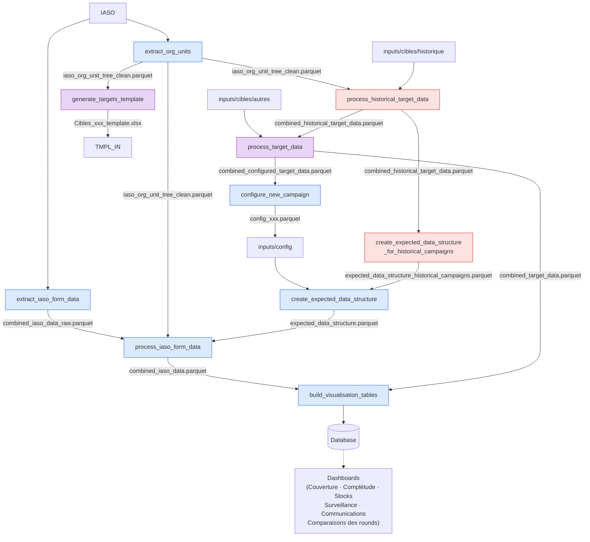

# RISP Niger - Multi-campaign

This workflow extracts and transforms data collected from a IASO form filled by Niger's health ministry workers over the course of vaccination campaigns, and loads them into an OpenHEXA database that feeds a PowerBI dashboard allowing the live tracking of KPIs of these campaigns.

---

## 📐 Architecture & Workflow Overview

