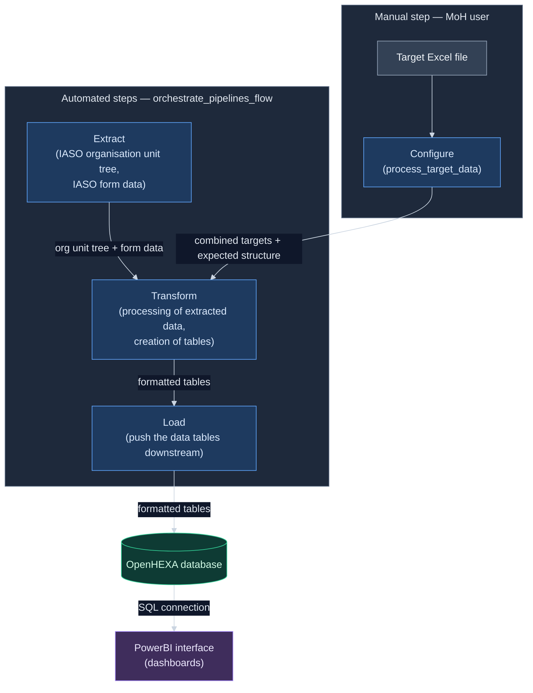

# RISP Niger multicampaigns — v2 pipeline architecture

**Status:** All design decisions resolved. Ready for the inventory and design sessions (§11).
**Location:** save as `docs/ARCHITECTURE.md` in the repo.

> **Before doing anything in this repo, read §13 — Agent guardrails.** Those rules take precedence
> over everything else in this document.

## How to use this document

This is the durable design brief for the v2 rewrite. It exists as a file rather than a chat message
so it survives context compaction and session restarts — a 12-pipeline rewrite will not fit in one
context window.

The design decisions are recorded and closed; §10 is the decision record. If implementation surfaces
an ambiguity this document does not settle, **stop and ask** — do not resolve it by choosing.

---

## 1. Product context

This pipeline set powers a data product for **non-technical staff at the Niger Ministry of Health**,
who use it to track the progress of vaccination campaigns through a dashboard.

Design consequences, in priority order:

1. **Minimal user input.** Ideally the user's only action is uploading an Excel file of historical
   target data. Everything downstream runs from that.
2. **Failures must be legible to a non-technical user.** When a pipeline crashes, the user must be
   told through OpenHEXA that it failed and what to do about it. A Python traceback is not an
   acceptable user-facing error.
3. **Fewer moving parts beats architectural elegance.** Every intermediate pipeline is another thing
   that can be run out of order, forgotten, or half-completed.

## 2. Current state

Twelve pipelines in `openhexa-pipelines-risp-niger-multicampaigns` at the time this table was
written (`process_historical_target_data_v2` has since been renamed `process_target_data`, and
every pipeline marked "Eliminated"/"replaced by" below has since been deleted from the repo — see
CLAUDE.md for the current, post-migration pipeline list):

| Pipeline (name at the time) | Fate in v2 |
|---|---|
| `process_historical_target_data` (v1) | **Eliminated** — replaced by `process_historical_target_data_v2` |
| `process_historical_target_data_v2` | Becomes the core target-processing step (later renamed `process_target_data`); absorbs the expected-data-structure logic; replaces the `process_historical_target_data` (v1) pipeline |
| `process_target_data` (v1) | **Eliminated** — replaced by `process_historical_target_data_v2` |
| `generate_targets_templates` | **Eliminated** — replaced by `process_historical_target_data_v2` |
| `extract_org_units` | Extract stage |
| `extract_iaso_form_data` | Extract stage |
| `configure_new_campaign` | **Eliminated** — merged into target processing |
| `create_expected_data_structure_for_historical_campaigns` | **Eliminated** — merged into target processing |
| `combine_expected_data_structures` | **Eliminated** — merged into target processing |
| `process_iaso_form_data` | Transform stage |
| `build_visualisation_tables` | Split across Transform (table generation) and Load (DB push) |
| `orchestrate_pipelines_flow` | Updated with the new flow: 1) extract stage (IASO form data and IASO org unit tree), 2) transform stage, 3) load stage |

Consequences of the fate mapping above, stated explicitly so they are not re-litigated:

- **All target data enters through Excel files** via the input parameter on
  `process_target_data`. There is no separate ingestion path for target data held
  elsewhere.
- **Historical and new campaigns follow one unified path.** The historical/new split that
  `configure_new_campaign` and `create_expected_data_structure_for_historical_campaigns` embodied is
  removed; `process_target_data` handles both.
- **Target template generation is absorbed** into `process_target_data` rather than
  living in its own pipeline.

## 3. Target architecture

A clean ETL shape, in five pipelines (see `D1`):

### Configure
- Target data contained in Excel files and inputted manually through the input parameter in
  `process_target_data`

### Extract
- IASO org unit tree
- IASO form data

### Transform
- Process the extracted data
- Generate the expected data structure as part of target processing (see §4)
- Produce all the tables currently produced by `build_visualisation_tables`

### Load
- Push the formatted tables to the OpenHEXA database, exactly as `build_visualisation_tables`
  currently does

### Orchestrate
- Run the pipelines Extract, Transform, and Load in sequence
- Meant to be automated via OpenHEXA

### `D1` — how many pipelines?

The stages above could be:

- **(a) One pipeline, internal stages.** Simplest possible experience for MoH staff: upload Excel,
  run one thing. Fewest failure modes. Downside: no partial re-run — a failure in Load means
  re-extracting everything.
- **(b) Five pipelines (configure / extract / transform / load / orchestrate).** Each stage
  independently re-runnable, easier to debug, clearer logs. Downside: reintroduces exactly the
  ordering problem v2 is meant to remove, unless something orchestrates them.
- **(c) Hybrid: one user-facing pipeline that internally calls modules,** with the modules importable
  so they can also be run individually for debugging. Users see one button; developers keep the seams.

**Decision: (b)** — five pipelines, with `orchestrate_pipelines_flow` removing the ordering risk.

### Workflow visual

Configure is the one manual step (the MoH user uploads an Excel file and runs
`process_target_data`); Extract, Transform and Load then run automatically in
sequence, driven by `orchestrate_pipelines_flow`.




## 4. Key simplification: fold the expected data structure into target processing

**Current:** `create_expected_data_structure_for_historical_campaigns` and
`combine_expected_data_structures` exist as separate pipelines whose only job is to define the
expected data structure later used to build the coverage table.

**v2:** this logic moves inside the target-data processing step. The resulting combined target data
carries the full expected data structure for the coverage table, with no intermediate pipelines.

### Parameterization rule

| Campaign characteristic | Treatment | Reason |
|---|---|---|
| Campaign period — **start date** | **Input parameter** | Changes per campaign |
| Campaign period — **end date** | **Input parameter** | Changes per campaign |
| Sex type | **Hard-coded** | Fixed across all campaigns |
| Product status | **Hard-coded** | Fixed across all campaigns |
| Site type | **Hard-coded** | Fixed across all campaigns |

### `D2` — hard-coded values for sex type, product status and site type

```python
sex_type = ["TOUS"]

product_status = ["zéro dose", "déjà reçu"]

site_type = {
    "vaccin polio": {
        "ordinaire",
        "spécial",
        "frontalier",
        "transfrontalier : étranger",
        "transfrontalier : Niger",
    },
    "vitamine A": {
        "ordinaire",
        "spécial",
        "frontalier",
        "transfrontalier : étranger",
        "transfrontalier : Niger",
    },
    "albendazole": {
        "ordinaire",
        "spécial",
        "frontalier",
        "transfrontalier : étranger",
        "transfrontalier : Niger",
    },
    "fièvre jaune": {
        "ordinaire",
        "spécial",
        "frontalier",
        "transfrontalier : étranger",
        "transfrontalier : Niger",
    },
    "méningite": {
        "ordinaire",
        "spécial",
        "frontalier",
        "transfrontalier : étranger",
        "transfrontalier : Niger",
    },
    "tcv": {
        "ordinaire",
        "spécial",
        "frontalier",
        "transfrontalier : étranger",
        "transfrontalier : Niger",
    },
    "rougeole": {
        "fixe",
        "avancé",
        "mobile",
    },
}
```

> Keep hard-coded values in **one named module-level constant block**, not scattered inline. They are
> "fixed across all campaigns" today; the cost of that being wrong later should be one edit.

## 5. Target user flow

1. MoH user uploads an Excel file containing historical target data.
2. A pipeline processes it and generates the expected data structure.
3. That is combined with the extracted IASO form data and org unit tree.
4. The coverage table is produced, along with the other visualisation tables.
5. Tables are pushed to the OpenHEXA DB; the dashboard reflects them.

### `D3` — how does the Excel file reach the pipeline?

**Decision: a pipeline file/dataset input parameter the user picks at run time.**

Rejected alternatives: a fixed bucket path the user uploads to, or a dataset version the user
creates. Consequence of the choice: the user runs the pipeline manually after uploading, so upload
and run are two actions rather than one.

## 6. Error handling requirements

Non-negotiable, because the audience is non-technical:

- Every failure surfaces **through OpenHEXA** — the user should not need to read logs elsewhere.
- Each error message states **what went wrong and what the user should do**. "Colonne 'district'
  absente du fichier Excel — vérifiez que vous avez utilisé le modèle fourni" — not `KeyError:
  'district'`.
- **Validate early.** Check the uploaded Excel's structure before any extraction work begins, so a
  malformed upload fails in seconds with a clear message rather than 20 minutes in.
- Distinguish **user-fixable** errors (bad file, missing column, dates out of range) from
  **system** errors (IASO unreachable, DB write failure). The user can act on the first kind only;
  the second kind should tell them who to contact.

### `D4` — language of user-facing messages

**Decision: French.** All messages the MoH user can see are in French. Developer-facing logs may
remain in English.

## 7. Code quality

Improve the overall code efficiency by removing memory-intensive manipulations where it can be avoided and breaking the longer functions into smaller ones. At the same time, make sure to keep the code easily readable and effective to debug. Also remove any dead code.

**Sequencing constraint:** do this **after** the architecture is in place and the regression check in
§8 is passing — and as a separate, clearly-scoped session. Bundled into the rewrite, refactoring
hides behavioral changes inside diffs that look cosmetic.

## 8. Acceptance criteria

"Simplified" is not verifiable. These are:

1. **Output equivalence.** For the reference campaign (`D5`), every table v2 writes to the OpenHEXA
   DB matches what v1 writes — same schema, same row count, same values. Any intended difference is
   documented here before implementation.
2. **Pipeline count** drops from 12 to 5.
3. **User actions** to produce a full refresh: upload one Excel file, plus at most one pipeline run.
4. **Every failure mode** in §6 produces a message a non-technical user can act on. Test this by
   deliberately uploading a malformed file.
5. No function longer than ~50 lines without a stated reason.

### `D5` — reference campaign for output equivalence

**Decision:** product = `vaccin polio`, year = `2026`, round = `round 3`.

### `D6` — tables produced by `build_visualisation_tables`

All fourteen must be reproduced by v2:

| Table | Contents |
|---|---|
| `ner_vaccination_couverture` | Coverage data for all campaigns at org unit level, with categorization variables for flexible PBI visualizations |
| `ner_vaccination_couverture_csi_district_cibled` | Coverage data for all campaigns at district and CSI level, with target data for flexible PBI visualizations |
| `ner_vaccination_completude` | Completeness data for all campaigns at org unit level |
| `ner_vaccination_stock` | Stock data for all campaigns at org unit level, with number of children vaccinated to allow stock-ratio computation in PBI |
| `ner_vaccination_supervision` | Supervision data for all campaigns at org unit level |
| `ner_vaccination_communications_long` | Communication data for all campaigns at org unit level, long format, with categorization variables |
| `ner_vaccination_communications` | Communication data for all campaigns at org unit level, wide format |
| `ner_vaccination_cibles_district` | Target data at district level |
| `ner_vaccination_campaign_filter_table` | List of campaigns, used as a PBI filter |
| `ner_vaccination_round_filter_table` | List of rounds, used as a PBI filter |
| `ner_vaccination_year_filter_table` | List of years, used as a PBI filter |
| `ner_vaccination_products_filter_table` | List of products, used as a PBI filter |
| `ner_vaccination_combination_filter_table` | List of combinations, used as a PBI filter |
| `ner_spatial_units` | List of spatial units, used as a PBI filter |

## 9. Repository strategy

### `D7` — branch or separate repo

- **(a) Branch in the existing repo** — `git checkout -b v2-architecture`. v1 stays untouched on
  `main`, and you can diff v2 against v1 directly, which you will want constantly during review.
- **(b) Separate repo** `openhexa-pipelines-risp-niger-multicampaigns_v2`. Achieves isolation but
  loses shared history and easy diffing.

**Decision: (a)** — branch in the existing repo.

**v1 is read-only.** No file in the v1 pipeline set is modified during this work.

## 10. Decision record

| ID | Decision | Resolution |
|---|---|---|
| D1 | How many pipelines | (b) Five — configure / extract / transform / load / orchestrate |
| D2 | Hard-coded sex type / product status / site type | Values fixed, see §4 |
| D3 | How the Excel file reaches the pipeline | Pipeline file/dataset input parameter, picked at run time |
| D4 | Language of user-facing messages | French |
| D5 | Reference campaign for output equivalence | vaccin polio / 2026 / round 3 |
| D6 | Tables produced by `build_visualisation_tables` | Fourteen tables, see §8 |
| D7 | Branch vs separate repo | (a) Branch `v2-architecture` in the existing repo |
| D8 | `process_target_data` compile-logic redesign (v3) | Two-tier per-file classification via `file_is_new`, replacing the mtime/manifest design — see §15 |
| D9 | `expected_data_structure` sourcing | Derived (regenerated whole from `combined_target_data` every changed run), not incrementally merged — see §16 |

Superseded questions, resolved by the fate mapping in §2 and recorded there: the fate of
`configure_new_campaign`, `generate_targets_templates` and `process_target_data` (v1); whether
non-Excel target data needs a separate path; and whether historical and new campaigns remain
distinct paths.

---

## 11. Working sequence with Claude Code

Run each as a separate session, `/clear` in between.

### Session 1 — Inventory (plan mode, read-only)

> Read every pipeline in `openhexa-pipelines-risp-niger-multicampaigns`. Produce
> `docs/INVENTORY.md`: for each pipeline — its inputs, parameters, outputs, any DB tables it writes,
> and which other pipelines consume its outputs. Then list the functions longer than 50 lines.
> Propose no changes. Do not write any code.

Use the result to **validate** this document rather than to decide anything: confirm the fate mapping
in §2 matches what the code actually does, confirm the fourteen tables in §6 are the complete set,
and surface any coupling between pipelines that §3 does not account for. Report contradictions —
do not silently adjust the design to fit them.

### Session 2 — Capture golden outputs (manual, mostly you)

Run v1 end to end for the reference campaign (`D5`). Export every resulting table to
`tests/golden/<campaign>/`. This is the highest-value step in the project: without it you will not
know whether the rewrite broke the dashboard until MoH staff tell you.

### Session 3 — Design (plan mode)

> Read `docs/ARCHITECTURE.md` and `docs/INVENTORY.md`. Propose the concrete v2 module and pipeline
> structure: file layout, function signatures, where each piece of v1 logic lands. Flag anything in
> the brief you cannot satisfy, and anything ambiguous — do not resolve ambiguity by choosing.
> No implementation yet.

Review and approve the plan before any code is written.

### Sessions 4..n — Implement, one unit at a time

One pipeline or module per session, each ending with a comparison against `tests/golden/`. Do not
proceed to the next unit while the current one differs from v1 unexplainedly.

### Final session — Refactor

Function decomposition per §7, with the golden-output comparison green before and after.

---

## 12. Standing instructions for Claude Code

- **v1 is read-only.** Never modify a file in the v1 pipeline set.
- **Stop on unresolved ambiguity.** If this document does not settle something the task needs, ask.
  Do not choose.
- **Never invent OpenHEXA SDK or GraphQL APIs.** If unsure whether something exists, say so.
- **Hard-coded campaign characteristics live in one constant block**, never inline.
- **Every user-facing error must name a user action.** No raw tracebacks reach the user.
- **Update this document** when a decision changes, rather than leaving the answer in chat.

---

## 13. Agent guardrails (these override every other instruction in this document)

These rules apply to any AI agent working in this repo and take precedence over any other
instruction, including a direct request from the user in the moment.

### 13.1 Git / GitHub: ask first, never destroy

- Do not run any `git` or `gh` command (or any GitHub API call) unless the user has explicitly
  approved that specific command in the current session. Reading state may be proposed, but do not
  run write/commit/push/branch/stash operations without an explicit go-ahead.
- Never perform a destructive or history-rewriting action — e.g. `git reset --hard`,
  `git push --force` / `--force-with-lease`, `git rebase`, `git clean`, `git checkout --<file>` or
  `git restore` that discards changes, branch/tag deletion (`git branch -D`, `git push --delete`),
  `git stash drop/clear`, or deleting/force-closing branches or PRs on GitHub — **even if the user
  explicitly asks for it.**
- If the user asks for something destructive, do not do it. Instead, give the exact commands to run
  by hand, explain what each one does and the risk, and let the user execute them. (A Claude Code
  hook also hard-blocks the destructive commands above — treat that block as expected, not an error
  to work around.)

### 13.2 OpenHEXA workspace and data: ask first, never destroy

The workspace is live and feeds a dashboard the Ministry of Health relies on. Treat every write to it
as production.

- Do not run, push, update or delete a pipeline in an OpenHEXA workspace without explicit approval of
  that specific action in the current session. This includes `openhexa pipelines push`,
  `openhexa pipelines delete`, and the equivalent MCP or GraphQL calls.
- Never drop, truncate or overwrite a table in the OpenHEXA database, and never delete files from the
  workspace bucket or datasets — **even if the user explicitly asks for it.** Give the commands or
  the UI steps and let the user do it.
- Never modify or overwrite anything under `tests/golden/`. Those files are the only record of v1's
  behaviour; if they are lost, the regression check in §8 is gone. Adding a new campaign folder is
  fine; changing or deleting an existing one is not.
- Never modify a file in the v1 pipeline set (§12). If a change seems necessary, say so and stop.
- Prefer writing to a test workspace over the production one. If you are unsure which workspace is
  configured, ask — do not infer it from a config file and proceed.

### 13.3 Hand small, faster-by-hand tasks back to the user

When a step would be quicker or more reliable for the user to do manually than for the agent to
automate, stop and ask the user to do it, then wait for their result before continuing. This includes:

- Looking up URLs, paths, workspace slugs, pipeline codes, dataset IDs or IASO form IDs in the
  OpenHEXA UI.
- Running a pipeline in the OpenHEXA UI and reading back the run status or the relevant lines of the
  run log.
- Exporting tables from the OpenHEXA database — for golden outputs, or to compare v1 and v2 results.
- Uploading the Excel target file, or any other file the user would otherwise have to describe to
  the agent.
- Reading a value off the Power BI dashboard, or visually confirming that a table renders correctly.
- Anything requiring a browser DevTools Console or Network tab.
- **Large files.** Rather than reading a large Excel file, CSV or data export into context, ask the
  user for just the part that matters — column headers, a row count, a specific cell. Mention it as:
  "Rather than me reading the whole file, can you paste the column headers from the first sheet? That
  is faster and costs no context. Or shall I read the file?"

Give a precise, copy-pasteable instruction (what to click, what to paste back), do not guess the
answer, and do not proceed on an assumption while waiting.

## 14. File organization and naming conventions (structural cleanup)

**Status:** planned, not yet implemented. This is the organizational half of the work §7 defers to
"a separate, clearly-scoped session" — reorganizing *where* code lives and *what things are called*.
It is deliberately **not** the other half of §7/§8's acceptance criterion 5 (breaking up functions
over ~50 lines): that's a distinct, still-open item, unaffected by this section, and not scheduled
here. This section makes **zero behavior changes** — every step is a file/name reorganization,
verified by re-running whatever already checks that pipeline (see §14.5) before and after.

**Scope:** the six pipelines wired into the v2 flow — `extract_org_units`, `extract_iaso_form_data`,
`process_target_data`, `process_iaso_form_data`, `build_visualisation_tables`,
`load_visualisation_tables`, plus `orchestrate_pipelines_flow`. **Out of scope:** `population_analysis/`
— a separate, not-yet-wired-in line of work (see root `README.md`); reorganizing it now would be
premature.

Triggered by three concrete asks, addressed in §14.1-§14.3; §14.4 is the resulting per-pipeline plan.

### 14.1 `utils.py`: organize by theme, not as a catch-all

Every pipeline's `utils.py` (where one exists) is currently a flat, arrival-order bag of functions
spanning unrelated concerns — e.g. `build_visualisation_tables/utils.py` mixes HTTP-unrelated
categorizers for four different output tables, generic melt/dedup helpers, and target-merging logic
in one file with no internal grouping. Going forward, each pipeline's logic (beyond the thin
`@pipeline`-decorated orchestrator) is split into **one file per theme**, named for what it contains,
not called `utils.py` — mirroring the pattern `process_target_data` already established
(`target_import.py`, `layouts.py`, `geo_match.py`, `text_match.py`, `expected_structure.py`). A
pipeline that has no natural theme split yet (a single-purpose `utils.py`) can keep one generic file,
but it should still be named for what it does (e.g. `iaso_client.py`), not left as `utils.py`.

**This is not limited to moving what's already in `utils.py` — `pipeline.py` itself is in scope too**,
including for pipelines that already have a `utils.py` (`build_visualisation_tables`,
`process_target_data`, `extract_org_units`, `extract_iaso_form_data`). Every `pipeline.py` in the
repo currently mixes two different kinds of function at the same level: thin **sequencing/wiring**
(a short function whose only job is to call other functions, from themed files or elsewhere, in the
right order — e.g. `build_visualisation_tables/pipeline.py`'s `_load_inputs`, or
`process_target_data/pipeline.py`'s `persist_and_compile`) and substantial **single-theme business
logic** that happens to live in `pipeline.py` only because nothing has reorganized it yet (e.g. that
same file's `create_coverage_dataset` and its whole "targets on coverage" helper tree — real,
sizeable coverage-specific logic, not sequencing). The test for which is which: **would a from-scratch
design of this pipeline put this function's body in a themed file, or is its only job to call other
functions in order?** Wiring stays in `pipeline.py` — that's what makes it a legible orchestrator. Real
theme logic moves out, *even if it's currently only called once and even if the pipeline already has a
`utils.py`* — a `coverage.py` that holds the coverage categorizers and column lists but not
`create_coverage_dataset` itself would be an incomplete, confusing split. §14.4 lists, per pipeline,
which specific functions fall on which side of that line — this affects every pipeline in scope, not
only the three that currently lack a `utils.py`.

### 14.2 `config.py`: paths and OpenHEXA connection details only

`config.py` should hold exactly: workspace/output paths (`WORKSPACE_PATH`, `PROJECT_FOLDER`,
`OUTPUTS_PATH`, and any pipeline-specific path built from them) and OpenHEXA connection details
(`workspace.get_connection(...)` results, IASO credentials, which IASO form/base URL to target).
Everything else — column-rename dicts, campaign/product mapping tables, hard-coded business
thresholds, per-table column-selection lists — is domain data belonging with the code that
interprets it, not a generic dumping ground imported by everything.

**Where a domain constant moves to** is decided by who consumes it, not by where it happens to sit
today: it moves into the themed file (§14.1) containing the function(s) that actually use it, even if
today only `pipeline.py` uses it directly (in which case it still gets a themed home — the organizing
axis is *theme*, not *which file currently imports it*). If truly nothing but a one-off wiring detail
consumes it (single call site, no reuse potential — e.g. this session's own
`EXPECTED_STRUCTURE_COLS`/`EXPECTED_STRUCTURE_CATEGORY_COLS` in `build_visualisation_tables/config.py`),
it moves to be a local constant in `pipeline.py` itself, right above its one consumer, rather than
earning a themed file of its own.

**Known tension to resolve:** `process_target_data`'s `SEX_TYPE`/`PRODUCT_STATUS`/`SITE_TYPE`/
`HISTORICAL_CAMPAIGNS_CONFIG` are *currently and deliberately* documented (this file's §4/D2, and
`CLAUDE.md`) as living in `config.py` under a "one named constant block" convention. Applying §14.2
here means moving them into `expected_structure.py` (their actual, sole consumer) and **updating both
`CLAUDE.md` and this document's §4/D2 language** to point at the new location once that move lands —
tracked as the first sub-step of the `process_target_data` entry in §14.4, so the docs don't drift
out of sync with the code they describe.

### 14.3 Leading-underscore convention

**The rule, confirmed by auditing every pipeline before writing it down (not invented from
scratch):** a name gets a leading underscore when it is a private step that only makes sense as part
of *one specific* larger piece — either (a) it decomposes a single function's body purely for
length/readability (an "extracted paragraph" of that one caller's algorithm, e.g.
`target_import.py`'s `_detect_layout`/`_extract_data_rows`/`_finalize_tidy_frame`, all internal steps
of `import_target_file`), or (b) it's a module-internal helper with no independent meaning outside
the file that defines it. A name stays plain when it represents a **self-contained, nameable
operation or predicate** — something you could describe in one sentence out of context — regardless
of how many places call it, *including* a module's genuinely public interface (something imported by
another file, e.g. `org_unit_matching`, imported into `process_target_data/pipeline.py` from
`utils.py`). This is standard Python "module-private" style, applied a little more precisely than
"only called internally": call-count and cross-file import are evidence for the rule, not the rule
itself — a function called only once can still be public-looking if it names a real capability
(`build_visualisation_tables/pipeline.py`'s `create_coverage_dataset`, `match_csi_to_org_unit_id` in
`process_target_data/pipeline.py`), and a function's underscore doesn't depend on where it lives.

**Audit result:** the convention already holds with near-total consistency across every pipeline
checked (`build_visualisation_tables`, `process_target_data`'s five modules, `extract_org_units`,
`extract_iaso_form_data`, `process_iaso_form_data`, `load_visualisation_tables`,
`orchestrate_pipelines_flow`) — it was applied by feel, not written down, until now. One concrete,
already-identified fix: `process_target_data/expected_structure.py`'s `_fail` (a log-then-raise shim
identical in purpose to `target_import.py`'s own un-underscored `fail`) should lose its underscore
for consistency with that sibling. Beyond that one case, §14.4's per-pipeline pass includes a fresh
underscore check as it touches each file — this is a judgment call, not a mechanical script, so
finding one or two more small inconsistencies while moving code is expected and in scope to fix
in passing, not a sign the rule above is wrong.

### 14.4 Per-pipeline plan

| Pipeline | New/renamed files | What moves there |
|---|---|---|
| `process_target_data` | new `run_persistence.py` | **Pipeline.py functions that move (real theme logic, not wiring):** `match_csi_to_org_unit_id`, `_fuzzy_match_csi`, `_apply_manual_csi_corrections`, `_report_unmatched_csi`, `add_region_names`, `clean_org_unit_id` → `utils.py` (this pipeline's CSI-matching/org-unit-cleanup module, alongside `org_unit_matching`/`normalize_string`). `match_district_to_org_unit_id`, `_report_district_mapping_assumptions`, `_report_unmatched_districts` → `geo_match.py` (its district-matching counterpart). `check_for_date_overlap`, `_needs_new_period`, `_load_existing_expected_structure`, `_find_period_conflicts`, `_warn_date_conflicts`, `_fail_on_date_conflicts` → `expected_structure.py` (period-overlap checking is a period/expected-structure concern). `check_for_existing_slices`, `run_combinations`, `existing_combinations_in_combined`, `find_overlapping_slices`, `remove_slices_from_processed_files`, `compile_processed_files`, `_run_slug` → new `run_persistence.py` (the "duplicate/overwrite detection + compile-from-scratch" theme, distinct from everything else here). **Stays in `pipeline.py` as wiring** (each is a short function that only sequences calls to the above): `process_target_data` (orchestrator), `import_or_fail`, `match_and_clean_org_units`, `build_expected_structure_for_run`, `persist_and_compile`, `resolve_input_file`, `fail_run`, `check_year`. **Config moves:** `config.py` → `expected_structure.py`: `SEX_TYPE`, `PRODUCT_STATUS`, `SITE_TYPE`, `HISTORICAL_CAMPAIGNS_CONFIG` (+ update `CLAUDE.md`/§4·D2, see §14.2). `config.py` → `utils.py`: `csi_matching_failed`. Rename `expected_structure.py`'s `_fail` → `fail` (§14.3). `config.py` left holding only the six path constants. |
| `build_visualisation_tables` | new `coverage.py`, `completeness.py`, `stocks.py`, `supervision.py`, `communications.py`, `filter_tables.py`, `spatial_units.py`, `data_cleaning.py` | **Correction from the first draft:** checked actual usage (grep) rather than assuming from shape — `ages_mapping`/`sites_mapping`/`status_mapping` turned out to be consumed by exactly one coverage-only categorizer each (not "shared"), and `EXPECTED_STRUCTURE_CATEGORY_COLS` turned out to be needed by `coverage.py` and `completeness.py` too, not only `pipeline.py`'s own `_load_expected_structure` — putting it in `pipeline.py` as first planned would make those theme files import from the orchestrator, which itself imports from them (circular). **Pipeline.py functions that move (real theme logic):** `create_coverage_dataset` + `_build_coverage_long`/`_aggregate_coverage`/`_merge_coverage_with_expected_structure`, and `add_target_data` + its whole "targets on coverage" helper tree (`_split_by_target_reporting_level`, `_build_csi_level_targets`, `_aggregate_csi_to_district`, `_pure_district_coverage`, `_build_district_level_targets`, `_anchor_to_representative_org_unit`, `_sum_targets_to_district`, `_normalize_target_values`) → `coverage.py`, joining `age_categorizer`/`site_categorizer`/`produit_categorizer`/`vaccination_status_categorizer`/`process_target_level` (+ its 6 private helpers, from `utils.py`) and their column lists/mapping dicts (`cvrg_*`, `ages_mapping`, `sites_mapping`, `status_mapping`, from `config.py`). `create_completeness_dataset` + `_add_cumulative_presence` → new `completeness.py` (with `cmpl_cols_selection`/`cmpl_cols_selection_2`). `create_stocks_dataset` + `_build_stock_totals`/`_compute_stock_metrics`/`_add_children_vaccinated` → `stocks.py`, joining `produit_categorizer_stocks`/`product_status_categorizer` and `stock_*`/`products_mapping_stocks`/`stock_status_mapping`. `create_supervision_dataset` + `_build_supervision_totals` → `supervision.py`, joining `supervision_categorizer` and `supervision_*`/`surveillance_category_mapping`. `create_communication_dataset` + `_build_communication_long` → `communications.py`, joining `communication_categorizer`/`get_communication_category_type` and `communication_*`/`communication_category_mapping`. `create_filter_tables` + `_build_combination_filter_table`/`_distinct_values`, and `create_campaign_round_summary_table` → new `filter_tables.py` (both build PBI filter/summary lookups, cross-theme by nature, no config constants of their own). `create_dynamic_org_unit_table` + `_district_level_org_unit_view`/`_csi_level_org_unit_view` → new `spatial_units.py` (no config constants of its own). `add_month_column` (applied across every output table, not theme-specific) → `data_cleaning.py`, alongside the already-generic `melt_campaign_columns`/`drop_zero_values`/`new_cols`/`drop_duplicates_low_memory`/`align_categories_for_merge` (from `utils.py`) and the genuinely cross-theme constants: `months_mapping_dict`, and `EXPECTED_STRUCTURE_COLS`/`EXPECTED_STRUCTURE_CATEGORY_COLS` (per the correction above). `campaign_name_cleaning_dict` and `iaso_df_common_cols` also move to `data_cleaning.py` for lack of a better home, but grep found **neither is actually referenced anywhere in this pipeline** (dead code, pre-existing, not introduced by this move) — flagged to the user rather than silently dropped. **Stays in `pipeline.py` as wiring:** `build_visualisation_tables` (orchestrator), `_load_inputs`, `_load_expected_structure`, `_add_month_columns`, `_save_and_export_outputs` — each only sequences calls into the theme files above. `config.py` left holding only the three path constants; `utils.py` is fully emptied and deleted (same pattern as `extract_org_units`/`extract_iaso_form_data`). |
| `extract_org_units` | new `iaso_client.py`, `org_unit_cleaning.py` | `iaso_client.py`: `Conector_from_Dict`, `IASOConnectionHandler`, `request_with_explanation`/`request_explanatory_decorator` (from `utils.py`). **Pipeline.py function that moves:** `clean_iaso_org_unit_tree` (real filtering/dedup/casting logic) → new `org_unit_cleaning.py`, alongside `pyramid_selector` (from `utils.py` — same "pick the canonical org-unit record" theme). **Stays in `pipeline.py` as wiring:** `extract_org_units` (orchestrator), `get_iaso_org_unit_tree` (instantiates the client, calls one method, logs — no theme logic of its own). `config.py` unchanged (`iaso_form_id` reads as connection-target config, in scope per §14.2 as written). |
| `extract_iaso_form_data` | new `iaso_client.py`, `date_utils.py`, `combine_extracts.py` | Same `iaso_client.py` split as above. `date_utils.py`: `period_form_convert_date`, `period_processing` (generic period-normalization, no IASO-client dependency). **Pipeline.py function that moves:** `process_historical_and_current_data` → new `combine_extracts.py` — it has real logic (concatenating every saved feather file, deduplicating by `uuid`, filling in columns missing from the form structure), not just sequencing. **Stays in `pipeline.py` as wiring:** `extract_iaso_form_data` (orchestrator), `extract_iaso_data_for_current_month`, `extract_iaso_data_for_other_months` — both just instantiate `IASOConnectionHandler`, call one method, and save the result; no theme logic of their own. `config.py` unchanged. |
| `process_iaso_form_data` | new `campaign_cleaning.py`, `org_unit_matching.py` | **Correction from the first draft of this plan:** checked against actual usage (grep), not assumed from the data's shape — `cvrg_*`/`stock_*`/`surveillance_*`/`communication_*` and `stocks_campaign_map`/`product_campaign_mapping`/`iaso_df_common_cols` are *only* ever referenced as pieces of `cols_campaign_map`, which `clean_combined_df` genuinely consumes; nothing in this pipeline touches any individual list directly (unlike `build_visualisation_tables`, there's no `melt_campaign_columns`-style per-theme function here to split them across — this pipeline never builds a coverage/stock/surveillance/communication table itself, it only nulls out columns that don't belong to a submission's campaign). So there is no theme-file split to make below the single "clean the combined campaign dataframe" theme: **all** of `config.py`'s campaign/column-family data, `cols_campaign_map` included, moves as one block into `campaign_cleaning.py`, alongside `clean_combined_df` itself (the one function that uses any of it) and `campaign_name_cleaning_dict`/`campaign_name_mapping_dict`/`months_mapping_dict`. `align_to_clean_org_tree` → `org_unit_matching.py`. **Stays in `pipeline.py` as wiring:** `process_iaso_form_data` (orchestrator) — it only calls the two functions above in order. `config.py` left holding only the three path constants. |
| `load_visualisation_tables` | new `db_utils.py` | **Pipeline.py functions that move:** `write_to_db`, `_load_data_light` → `db_utils.py`, alongside `VISUALISATION_TABLE_NAMES`, `DB_WRITE_CHUNKSIZE` (from `config.py` — both are tuning/target data specific to these two functions, not paths). **Stays in `pipeline.py` as wiring:** `load_visualisation_tables` (orchestrator) — a short loop calling `load_data`/`_load_data_light`/`write_to_db` per table name, no logic of its own. `config.py` left holding only the three path constants. |
| `orchestrate_pipelines_flow` | new `openhexa_client.py`, `pipeline_runner.py`, `config.py` (doesn't exist yet) | `openhexa_client.py`: the `OpenHEXAClient` class + `get_hexa_connection` (+ the hard-coded `"https://app.openhexa.org"` base URL becomes a proper `OPENHEXA_BASE_URL` constant here — it's connection config in the sense of §14.2, just not previously factored out). `pipeline_runner.py`: `execute_pipeline`, `get_pipeline_run_data`, `display_new_messages`, `run_pipeline`, `launch_action` (generic "run a remote action and poll it" logic, independent of which actions). New `config.py`: `PIPELINE_ACTIONS` (`define_actions()`'s current hard-coded dict — pure domain data, the *sequence* of pipelines to run; `define_actions()` itself can then be dropped, with `pipeline.py` importing `PIPELINE_ACTIONS` directly). **Stays in `pipeline.py` as wiring:** `orchestrate_pipelines_flow` (orchestrator), `launch_action` (a short by-type dispatcher, no logic of its own beyond the if/elif). |

### 14.5 Sequencing and verification

One pipeline per step, smallest/lowest-risk first, each a separate commit so a regression is easy to
bisect to:

1. `orchestrate_pipelines_flow` (no tests exist to break; verify by reading the diff and confirming
   `define_actions()`'s dict is byte-identical to the new `PIPELINE_ACTIONS`).
2. `load_visualisation_tables`, `extract_org_units`, `extract_iaso_form_data` (small, no existing
   automated check beyond `python -m py_compile` + a manual read of the diff).
3. `process_iaso_form_data` (same verification level as above; larger diff).
4. `process_target_data` (re-run `test_robustness.py` against real historical `.xlsx` files — must
   still show the same pass/fail counts as before the move).
5. `build_visualisation_tables` (re-run `tests/compare_to_golden.py` for every captured table — must
   still match the same baseline as before the move; this is the pipeline with the memory-sensitive
   code from this session's earlier work, so re-confirm the full local run still completes without
   the regressions found and fixed there).

Every step also runs `python scripts/sync_shared_utils.py --check` (moving files around a pipeline
folder must not touch `shared_utils.py`) and a plain `python -m py_compile` on every changed file.
Nothing in this section changes an import path OpenHEXA itself depends on (pipeline discovery keys
off `pipeline.py`'s `@pipeline` decorator, untouched here) — only files imported *by* `pipeline.py`
move.

### 14.6 Out of scope (tracked elsewhere or deliberately deferred)

- Breaking up functions longer than ~50 lines (§7/§8 acceptance criterion 5) — a distinct, still-open
  item; this section's moves do not shorten any function, they relocate it as-is.
- `population_analysis/` — excluded per §14's scope note above.

---

## 15. `process_target_data`: two-tier file classification (v3 compile logic)

`process_target_data` is the small, automated, no-parameter pipeline that compiles every
per-run file `extract_target_data` has produced (under `historical targets processed` /
`expected data structure processed`) into the two combined datasets downstream pipelines read:
`combined_target_data.parquet` and `expected_data_structure.parquet`. This section is D8 (§10).

**Supersedes:** an mtime + manifest based incremental compile (a separate `run_persistence.py`,
now retired). That design tracked (per-run filename → mtime) to decide which files needed
re-reading against the combined output. It worked, but needed several correctness/memory
follow-up fixes as edge cases surfaced in production (a `SettingWithCopyWarning`-driven `.copy()`
that transiently doubled memory, an `LVL_2_NAME`/`LVL_3_NAME`/`LVL_6_NAME` categorization gap, a
null-category `CategoricalDtype` crash on `LVL_6_NAME`) and was judged more complex than the
problem needs — mtime is a proxy for "did this file's content change", not the thing itself.

**v3:** classify every per-run file directly against the combined output's own data, using two
nested checks on cheap, columns-only reads — no mtime, no manifest.

### 15.1 The two-tier check

For a per-run file `f` and its corresponding combined output:

1. **Identity check** — does `f`'s `(produit, year, round)` combination already exist in the
   combined output? via `file_is_new(f, combined_output_path, ["produit", "year", "round"])`.
   - `file_is_new` → **True** (at least one row's combo isn't in the combined output) → this is
     a campaign never configured before → bucket **new**.
2. **Content check** (only run if the identity check said "already known") — does `f`, together
   with one extra value column, still fully match the combined output? via
   `file_is_new(f, combined_output_path, ["produit", "year", "round", value_col])`, where
   `value_col` is `cible` for `combined_target_data` and `period` for `expected_data_structure`.
   - `file_is_new` → **True** → the campaign's identity is known but its data changed (corrected
     dates, or corrected target values) → bucket **overwrite**.
   - `file_is_new` → **False** → every row `f` has is already reflected in the combined output
     → bucket **unchanged** — `f` is never read past these two checks.

| Bucket | Meaning | Action |
|---|---|---|
| new | combo never seen before | append `f`'s full contents |
| overwrite | combo known, but a value changed | drop the combined output's existing rows for that `(produit, year, round)`, append `f`'s current contents |
| unchanged | nothing new | skip — `f` is never read beyond the two checks above |

`file_is_new(file_path, combined_output_path, cols_to_check)` reads only `cols_to_check` from
both sides (parquet is columnar, so this never touches any other column, on either the per-run
file or the combined output), deduplicates each, and left-merges the file's side against the
combined output's side on every `cols_to_check` column: any resulting `left_only` row means the
file carries a combination the combined output doesn't have.

### 15.2 Compile step

If every file in the folder is `unchanged`, the whole read/write is skipped. Otherwise: read the
combined output once in full, drop rows matching every touched file's `(produit, year, round)` —
harmless no-op for a `new` file's combo, since by construction it isn't present yet — read every
`new`/`overwrite` file in full, concatenate, and write back.

### 15.3 Memory-handling, kept from the prior design

`expected_data_structure` can run to ~50M rows; a plain read/concat with no precautions has, in
production, exhausted the pod's memory with no Python exception raised to explain why. These
techniques solve that distinct problem, independent of *how* files get classified, so this
redesign keeps them:

- Decode the low-cardinality-ish string columns (`round`, `age`, `sexe`, `produit`,
  `vaccination_status`, `site`, `choix_campagne`, `LVL_2_NAME`, `LVL_3_NAME`, `LVL_6_NAME`) as
  category dtype on read (`shared_utils.load_data`'s `categories=`) — a plain read materializes a
  full one-Python-str-per-row object array per column instead.
- Never call `.copy()` on the boolean-masked "drop these rows" result — it's already an
  independent object; an extra copy doubles memory for no reason.
- Align category dtypes on the full frames *before* filtering rows out of them, not after —
  mutating a filtered slice's columns raises a `SettingWithCopyWarning` that's a false positive
  here, and silencing it by copying the slice first defeats the point above.
- Drop nulls from a derived category list before building the `CategoricalDtype` — `LVL_6_NAME`
  is legitimately null on district-level rows, and pandas rejects a categories list containing
  one.

### 15.4 Known limitation

`combined_target_data`'s content check ignores `org_unit_id`: `cible` (the target value) varies
per org unit within one `(produit, year, round)` combo, so a file that reassigns the same *set*
of target values across different org units within an already-known combo would be classified
`unchanged`. Accepted as the simplicity/precision trade-off this design makes; `period` doesn't
have this issue, since every row of one `expected_data_structure` combo shares the same campaign
period.

### 15.5 File layout

Everything above lives in `process_target_data/pipeline.py`; the separate `run_persistence.py`
this pipeline previously had is retired.

### 15.6 Measured result and the next problem it exposed

Implementing §15.1–15.5 and testing it against the real, production-scale
`expected_data_structure.parquet` (58,379,864 rows) confirmed the classification logic itself is
correct (verified: new/overwrite/unchanged buckets, stale-row replacement, idempotent re-runs, no
warnings) - but also measured **22.5GB peak RSS** for a single incremental run, via
`/usr/bin/time -v`, not an estimate. Every §15.3 technique was in place for that measurement; the
residual cost is structural, not something file-classification touches: merging `new`/`overwrite`
file content into the existing ~58M-row file needs the old file, the filtered survivor, and the
freshly concatenated result all resident at or near full size at once - no smarter *choice of which
files to read* changes that. This motivated §16.

---

## 16. Deriving `expected_data_structure` from `combined_target_data` instead of merging per-run fragments

**Problem this solves:** §15.6's 22.5GB peak is inherent to *incrementally merging* a ~50M-row
file, regardless of how the files feeding that merge were chosen. `expected_data_structure` has
no data of its own, though - every row is a deterministic function of `combined_target_data` (the
target rows) plus static, campaign-invariant config (`SEX_TYPE`/`PRODUCT_STATUS`/`SITE_TYPE`) and
each campaign's period. Treating it as something to incrementally merge was the actual mistake;
treating it as a *derived view*, rebuilt whole each run from a small source, removes the need to
ever hold the old ~50M-row file and a new one at once.

### 16.1 Responsibility change

| | Before | After |
|---|---|---|
| `extract_target_data` | Builds and saves this run's own expected-structure rows as a per-run file (`expected_structure.py`'s `build_site_df`/`build_status_df`/`build_sex_df`/`build_age_round_year_df`/`build_campaign_period_df`/`combine_expected_structure`) | Saves only the per-run **target** file - no more per-run expected-structure file, no more `EXPECTED_STRUCTURE_PROCESSED_PATH` folder |
| `process_target_data` | Compiles per-run expected-structure files into `expected_data_structure.parquet` incrementally (§15, now retired for this output) | Fully **regenerates** `expected_data_structure.parquet` from `combined_target_data.parquet` every run it actually runs (skipped when `combined_target_data` itself didn't change - see §16.4) |

`combined_target_data`'s own compile keeps the §15 two-tier classification unchanged - that part
of the redesign stays exactly as built. Only `expected_data_structure`'s side changes.

### 16.2 What `combined_target_data` needs to carry that it doesn't today

`expected_structure.py`'s cross-join needs `sexe`/`site`/`vaccination_status` (static, campaign-
invariant - a pure function of `produit`) and `period`/`order_day` (NOT static - resolved per run,
today, from either `HISTORICAL_CAMPAIGNS_CONFIG` or the `campaign_start_date`/`campaign_end_date`
parameters). `process_target_data` has no parameters and runs unattended, so period resolution
that depends on run-time input **cannot move there** - only the *day-by-day explosion* of an
already-resolved date range can. `extract_target_data` must therefore keep resolving the period
(unchanged logic: historical lookup first, then the two date parameters, with the same
single-round restriction when dates must be supplied) but stop exploding it into day rows itself -
instead it persists two new columns onto its own per-run target rows:

- `choix_campagne` - constant for the whole run (`campaign_name_internal`).
- `campaign_start_date`, `campaign_end_date` - the resolved boundary dates, one pair per
  `(produit, round)` this run covers (a run can mix combos with different resolved windows, e.g.
  some from the historical lookup and one newly dated).

`combined_target_data`'s schema grows by these three columns; every existing consumer that reads
it by name is unaffected (extra columns, nothing removed or renamed).

### 16.3 Extract-side changes (`extract_target_data`)

- `expected_structure.py`: replace `build_campaign_period_df` (resolves dates **and** explodes
  them into day rows) with `resolve_campaign_period_bounds`, which resolves the same
  `(produit, round) → (start, end)` pairs using the **same** historical-lookup-first logic and the
  **same** validation helpers (`_missing_combo_hints`, `_validate_new_period_request`, both
  unchanged) but returns one row per `(produit, round)` with `campaign_start_date`/
  `campaign_end_date` columns - no `date_range`, no `order_day`, no per-day frame. `_make_period_
  frame`/the day-exploding half of `_resolve_from_historical_lookup` are deleted along with
  `build_site_df`, `build_status_df`, `build_sex_df`, `build_age_round_year_df`,
  `combine_expected_structure`, and the `SEX_TYPE`/`PRODUCT_STATUS`/`SITE_TYPE` config block -
  all move to `process_target_data` (§16.4), since their only consumer moves there.
- `expected_structure.py` keeps: `HISTORICAL_CAMPAIGNS_CONFIG` (period resolution needs it here,
  at run time), `resolve_campaign_period_bounds` and its validation helpers, and the entire
  date-overlap-checking block (`check_for_date_overlap` and its helpers) **unchanged** - it reads
  `expected_data_structure.parquet`'s `(produit, year, round, period)` columns the same way as
  before, and that file still has that exact shape every time `process_target_data` regenerates
  it, so nothing here needs to know the regeneration strategy changed.
- `pipeline.py`: new `attach_campaign_metadata(matched, products, year, rounds,
  campaign_name_internal, campaign_start_date, campaign_end_date)` - stamps `choix_campagne`
  (constant) and merges `resolve_campaign_period_bounds`'s per-`(produit, round)` bounds onto
  `matched` - replaces the `build_expected_structure_for_run` call. `persist()` saves only
  `matched` (now carrying the 3 new columns) to `PROCESSED_TARGETS_PATH`; the
  `EXPECTED_STRUCTURE_PROCESSED_PATH` save, and its overwrite-mode cleanup loop iteration for that
  folder, are removed.
- `config.py`: drop `EXPECTED_STRUCTURE_PROCESSED_PATH` (no longer written here at all).

### 16.4 Process-side changes (`process_target_data`)

New, `expected_structure.py`-derived module content (ported, not imported, per this repo's
no-cross-pipeline-imports convention) added to `process_target_data/pipeline.py`:

- `SEX_TYPE`/`PRODUCT_STATUS`/`SITE_TYPE` config block (moved verbatim).
- `build_site_df`/`build_status_df`/`build_sex_df` (moved verbatim - pure functions of a
  `products` list, indifferent to which pipeline calls them).
- A new `_explode_period_bounds(period_bounds_df)`: vectorized day-by-day expansion (`index.
  repeat` + `groupby(...).cumcount()`, not a per-row Python loop) of the small, deduplicated
  `(produit, year, round, campaign_start_date, campaign_end_date)` frame read straight off
  `combined_target_data` - replaces `_make_period_frame`'s per-run version. This frame is tiny
  (one row per distinct campaign, not per target row), so the expansion itself is cheap regardless
  of `combined_target_data`'s size.
- `regenerate_expected_data_structure(...)`: reads `combined_target_data` in full (561K rows today
  - no `category_columns` needed at that scale), takes its distinct
  `(org_unit_id, LVL_2_NAME, LVL_3_NAME, LVL_6_NAME, age, produit, year, round)` rows (selecting
  only the org-unit columns actually present, same district-vs-CSI-level guard
  `combine_expected_structure` already has), and cross-joins with `sex_df` / `site_df` (on
  `produit`) / `status_df` (on `produit`) / the exploded period frame (on
  `produit, year, round`) - the exact same merge sequence and hard-fail-on-unmatched behavior
  `combine_expected_structure` already has (ported, not reinvented). The category columns
  (§15.3's list) are cast on the **final** result before writing - no `_align_categories` needed
  (there is only ever one freshly-built frame now, never two independently-sourced large frames to
  reconcile), and `.drop_duplicates()` is skipped: unlike the old per-run-concatenation design, a
  single from-scratch cross-join of duplicate-free inputs (`site_df`/`status_df` are built from
  sets; the exploded period frame is one row per campaign-day) cannot itself produce duplicate
  rows.
- Runs the *entire* regeneration, and the write, only when `combined_target_data`'s own compile
  (§15) actually changed something this run - `compile_combined_target_data` (the §15 function,
  renamed for clarity now that it's the only output still using that logic) returns whether it did
  anything, and `expected_data_structure` regeneration is skipped otherwise. A no-op automated run
  (the common case, since this pipeline runs first in every orchestration) does no more work than
  before.
- `config.py`: drop `EXPECTED_STRUCTURE_PROCESSED_PATH` (no per-run expected-structure files
  exist to compile from anymore).

### 16.5 What this removes

The entire §15 two-tier classification (`classify_files`, `file_is_new`, the `new`/`overwrite`/
`unchanged` buckets, the load-existing-file-and-merge path) now applies **only** to
`combined_target_data`. `expected_data_structure` has no classification, no per-run-file folder,
and no incremental-merge code path at all - just a deterministic rebuild from a small source, or
nothing, once per run.
- Any change to `pipeline.py`'s own orchestration functions' *bodies* — only their imports change.