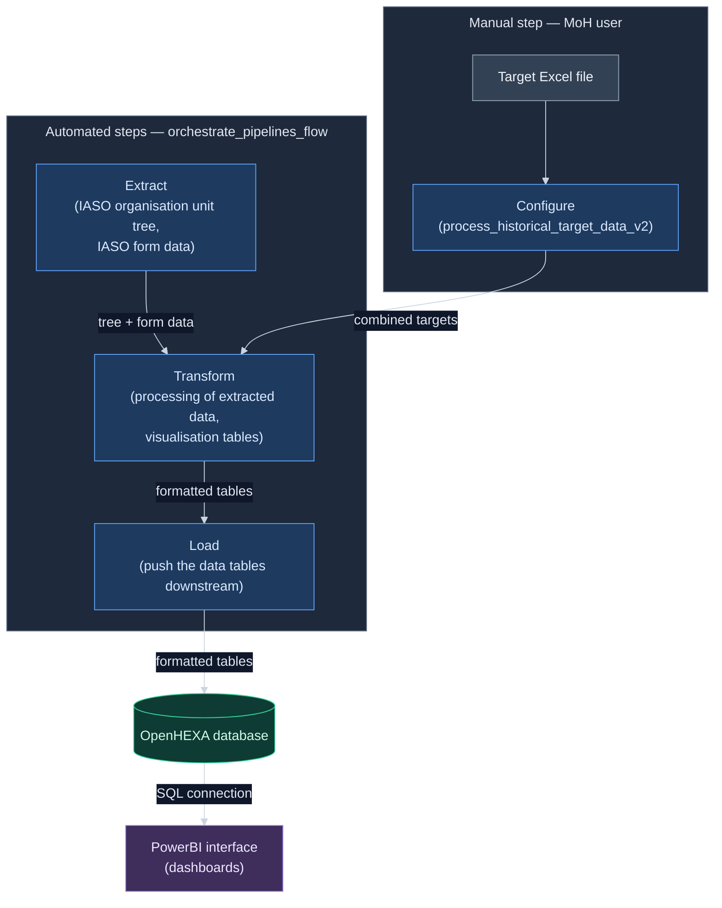

# RISP Niger multicampaigns — v2 pipeline architecture

**Status:** All design decisions resolved. Ready for the inventory and design sessions (§11).
**Location:** save as `docs/ARCHITECTURE.md` in the repo.

> **Before doing anything in this repo, read §13 — Agent guardrails.** Those rules take precedence
> over everything else in this document.

## How to use this document

This is the durable design brief for the v2 rewrite. It exists as a file rather than a chat message
so it survives context compaction and session restarts — a 12-pipeline rewrite will not fit in one
context window.

The design decisions are recorded and closed; §10 is the decision record. If implementation surfaces
an ambiguity this document does not settle, **stop and ask** — do not resolve it by choosing.

---

## 1. Product context

This pipeline set powers a data product for **non-technical staff at the Niger Ministry of Health**,
who use it to track the progress of vaccination campaigns through a dashboard.

Design consequences, in priority order:

1. **Minimal user input.** Ideally the user's only action is uploading an Excel file of historical
   target data. Everything downstream runs from that.
2. **Failures must be legible to a non-technical user.** When a pipeline crashes, the user must be
   told through OpenHEXA that it failed and what to do about it. A Python traceback is not an
   acceptable user-facing error.
3. **Fewer moving parts beats architectural elegance.** Every intermediate pipeline is another thing
   that can be run out of order, forgotten, or half-completed.

## 2. Current state

Twelve pipelines in `openhexa-pipelines-risp-niger-multicampaigns`:

| Pipeline | Fate in v2 |
|---|---|
| `process_historical_target_data` | To be replaced by `process_historical_target_data_v2` |
| `process_historical_target_data_v2` | Becomes the core target-processing step; absorbs the expected-data-structure logic; replaces the `process_historical_target_data` pipeline |
| `process_target_data` | To be replaced by `process_historical_target_data_v2` |
| `generate_targets_templates` | To be replaced by `process_historical_target_data_v2` |
| `extract_org_units` | Extract stage |
| `extract_iaso_form_data` | Extract stage |
| `configure_new_campaign` | **Eliminated** — merged into target processing |
| `create_expected_data_structure_for_historical_campaigns` | **Eliminated** — merged into target processing |
| `combine_expected_data_structures` | **Eliminated** — merged into target processing |
| `process_iaso_form_data` | Transform stage |
| `build_visualisation_tables` | Split across Transform (table generation) and Load (DB push) |
| `orchestrate_pipelines_flow` | To be updated with the new flow: 1) extract stage (IASO form data and IASO org unit tree), 2) transform stage, 3) load stage |

Consequences of the fate mapping above, stated explicitly so they are not re-litigated:

- **All target data enters through Excel files** via the input parameter on
  `process_historical_target_data_v2`. There is no separate ingestion path for target data held
  elsewhere.
- **Historical and new campaigns follow one unified path.** The historical/new split that
  `configure_new_campaign` and `create_expected_data_structure_for_historical_campaigns` embodied is
  removed; `process_historical_target_data_v2` handles both.
- **Target template generation is absorbed** into `process_historical_target_data_v2` rather than
  living in its own pipeline.

## 3. Target architecture

A clean ETL shape, in five pipelines (see `D1`):

### Configure
- Target data contained in Excel files and inputted manually through the input parameter in
  `process_historical_target_data_v2`

### Extract
- IASO org unit tree
- IASO form data

### Transform
- Process the extracted data
- Generate the expected data structure as part of target processing (see §4)
- Produce all the tables currently produced by `build_visualisation_tables`

### Load
- Push the formatted tables to the OpenHEXA database, exactly as `build_visualisation_tables`
  currently does

### Orchestrate
- Run the pipelines Extract, Transform, and Load in sequence
- Meant to be automated via OpenHEXA

### `D1` — how many pipelines?

The stages above could be:

- **(a) One pipeline, internal stages.** Simplest possible experience for MoH staff: upload Excel,
  run one thing. Fewest failure modes. Downside: no partial re-run — a failure in Load means
  re-extracting everything.
- **(b) Five pipelines (configure / extract / transform / load / orchestrate).** Each stage
  independently re-runnable, easier to debug, clearer logs. Downside: reintroduces exactly the
  ordering problem v2 is meant to remove, unless something orchestrates them.
- **(c) Hybrid: one user-facing pipeline that internally calls modules,** with the modules importable
  so they can also be run individually for debugging. Users see one button; developers keep the seams.

**Decision: (b)** — five pipelines, with `orchestrate_pipelines_flow` removing the ordering risk.

### Workflow visual

Configure is the one manual step (the MoH user uploads an Excel file and runs
`process_historical_target_data_v2`); Extract, Transform and Load then run automatically in
sequence, driven by `orchestrate_pipelines_flow`.



## 4. Key simplification: fold the expected data structure into target processing

**Current:** `create_expected_data_structure_for_historical_campaigns` and
`combine_expected_data_structures` exist as separate pipelines whose only job is to define the
expected data structure later used to build the coverage table.

**v2:** this logic moves inside the target-data processing step. The resulting combined target data
carries the full expected data structure for the coverage table, with no intermediate pipelines.

### Parameterization rule

| Campaign characteristic | Treatment | Reason |
|---|---|---|
| Campaign period — **start date** | **Input parameter** | Changes per campaign |
| Campaign period — **end date** | **Input parameter** | Changes per campaign |
| Sex type | **Hard-coded** | Fixed across all campaigns |
| Product status | **Hard-coded** | Fixed across all campaigns |
| Site type | **Hard-coded** | Fixed across all campaigns |

### `D2` — hard-coded values for sex type, product status and site type

```python
sex_type = ["TOUS"]

product_status = ["zéro dose", "déjà reçu"]

site_type = {
    "vaccin polio": {
        "ordinaire",
        "spécial",
        "frontalier",
        "transfrontalier : étranger",
        "transfrontalier : Niger",
    },
    "vitamine A": {
        "ordinaire",
        "spécial",
        "frontalier",
        "transfrontalier : étranger",
        "transfrontalier : Niger",
    },
    "albendazole": {
        "ordinaire",
        "spécial",
        "frontalier",
        "transfrontalier : étranger",
        "transfrontalier : Niger",
    },
    "fièvre jaune": {
        "ordinaire",
        "spécial",
        "frontalier",
        "transfrontalier : étranger",
        "transfrontalier : Niger",
    },
    "méningite": {
        "ordinaire",
        "spécial",
        "frontalier",
        "transfrontalier : étranger",
        "transfrontalier : Niger",
    },
    "tcv": {
        "ordinaire",
        "spécial",
        "frontalier",
        "transfrontalier : étranger",
        "transfrontalier : Niger",
    },
    "rougeole": {
        "fixe",
        "avancé",
        "mobile",
    },
}
```

> Keep hard-coded values in **one named module-level constant block**, not scattered inline. They are
> "fixed across all campaigns" today; the cost of that being wrong later should be one edit.

## 5. Target user flow

1. MoH user uploads an Excel file containing historical target data.
2. A pipeline processes it and generates the expected data structure.
3. That is combined with the extracted IASO form data and org unit tree.
4. The coverage table is produced, along with the other visualisation tables.
5. Tables are pushed to the OpenHEXA DB; the dashboard reflects them.

### `D3` — how does the Excel file reach the pipeline?

**Decision: a pipeline file/dataset input parameter the user picks at run time.**

Rejected alternatives: a fixed bucket path the user uploads to, or a dataset version the user
creates. Consequence of the choice: the user runs the pipeline manually after uploading, so upload
and run are two actions rather than one.

## 6. Error handling requirements

Non-negotiable, because the audience is non-technical:

- Every failure surfaces **through OpenHEXA** — the user should not need to read logs elsewhere.
- Each error message states **what went wrong and what the user should do**. "Colonne 'district'
  absente du fichier Excel — vérifiez que vous avez utilisé le modèle fourni" — not `KeyError:
  'district'`.
- **Validate early.** Check the uploaded Excel's structure before any extraction work begins, so a
  malformed upload fails in seconds with a clear message rather than 20 minutes in.
- Distinguish **user-fixable** errors (bad file, missing column, dates out of range) from
  **system** errors (IASO unreachable, DB write failure). The user can act on the first kind only;
  the second kind should tell them who to contact.

### `D4` — language of user-facing messages

**Decision: French.** All messages the MoH user can see are in French. Developer-facing logs may
remain in English.

## 7. Code quality

Break the longer functions into smaller ones, for readability and debuggability.

**Sequencing constraint:** do this **after** the architecture is in place and the regression check in
§8 is passing — and as a separate, clearly-scoped session. Bundled into the rewrite, refactoring
hides behavioral changes inside diffs that look cosmetic.

## 8. Acceptance criteria

"Simplified" is not verifiable. These are:

1. **Output equivalence.** For the reference campaign (`D5`), every table v2 writes to the OpenHEXA
   DB matches what v1 writes — same schema, same row count, same values. Any intended difference is
   documented here before implementation.
2. **Pipeline count** drops from 12 to 5.
3. **User actions** to produce a full refresh: upload one Excel file, plus at most one pipeline run.
4. **Every failure mode** in §6 produces a message a non-technical user can act on. Test this by
   deliberately uploading a malformed file.
5. No function longer than ~50 lines without a stated reason.

### `D5` — reference campaign for output equivalence

**Decision:** product = `vaccin polio`, year = `2026`, round = `round 3`.

### `D6` — tables produced by `build_visualisation_tables`

All fourteen must be reproduced by v2:

| Table | Contents |
|---|---|
| `ner_vaccination_couverture` | Coverage data for all campaigns at org unit level, with categorization variables for flexible PBI visualizations |
| `ner_vaccination_couverture_csi_district_cibled` | Coverage data for all campaigns at district and CSI level, with target data for flexible PBI visualizations |
| `ner_vaccination_completude` | Completeness data for all campaigns at org unit level |
| `ner_vaccination_stock` | Stock data for all campaigns at org unit level, with number of children vaccinated to allow stock-ratio computation in PBI |
| `ner_vaccination_supervision` | Supervision data for all campaigns at org unit level |
| `ner_vaccination_communications_long` | Communication data for all campaigns at org unit level, long format, with categorization variables |
| `ner_vaccination_communications` | Communication data for all campaigns at org unit level, wide format |
| `ner_vaccination_cibles_district` | Target data at district level |
| `ner_vaccination_campaign_filter_table` | List of campaigns, used as a PBI filter |
| `ner_vaccination_round_filter_table` | List of rounds, used as a PBI filter |
| `ner_vaccination_year_filter_table` | List of years, used as a PBI filter |
| `ner_vaccination_products_filter_table` | List of products, used as a PBI filter |
| `ner_vaccination_combination_filter_table` | List of combinations, used as a PBI filter |
| `ner_spatial_units` | List of spatial units, used as a PBI filter |

## 9. Repository strategy

### `D7` — branch or separate repo

- **(a) Branch in the existing repo** — `git checkout -b v2-architecture`. v1 stays untouched on
  `main`, and you can diff v2 against v1 directly, which you will want constantly during review.
- **(b) Separate repo** `openhexa-pipelines-risp-niger-multicampaigns_v2`. Achieves isolation but
  loses shared history and easy diffing.

**Decision: (a)** — branch in the existing repo.

**v1 is read-only.** No file in the v1 pipeline set is modified during this work.

## 10. Decision record

| ID | Decision | Resolution |
|---|---|---|
| D1 | How many pipelines | (b) Five — configure / extract / transform / load / orchestrate |
| D2 | Hard-coded sex type / product status / site type | Values fixed, see §4 |
| D3 | How the Excel file reaches the pipeline | Pipeline file/dataset input parameter, picked at run time |
| D4 | Language of user-facing messages | French |
| D5 | Reference campaign for output equivalence | vaccin polio / 2026 / round 3 |
| D6 | Tables produced by `build_visualisation_tables` | Fourteen tables, see §8 |
| D7 | Branch vs separate repo | (a) Branch `v2-architecture` in the existing repo |

Superseded questions, resolved by the fate mapping in §2 and recorded there: the fate of
`configure_new_campaign`, `generate_targets_templates` and `process_target_data`; whether non-Excel
target data needs a separate path; and whether historical and new campaigns remain distinct paths.

---

## 11. Working sequence with Claude Code

Run each as a separate session, `/clear` in between.

### Session 1 — Inventory (plan mode, read-only)

> Read every pipeline in `openhexa-pipelines-risp-niger-multicampaigns`. Produce
> `docs/INVENTORY.md`: for each pipeline — its inputs, parameters, outputs, any DB tables it writes,
> and which other pipelines consume its outputs. Then list the functions longer than 50 lines.
> Propose no changes. Do not write any code.

Use the result to **validate** this document rather than to decide anything: confirm the fate mapping
in §2 matches what the code actually does, confirm the fourteen tables in §6 are the complete set,
and surface any coupling between pipelines that §3 does not account for. Report contradictions —
do not silently adjust the design to fit them.

### Session 2 — Capture golden outputs (manual, mostly you)

Run v1 end to end for the reference campaign (`D5`). Export every resulting table to
`tests/golden/<campaign>/`. This is the highest-value step in the project: without it you will not
know whether the rewrite broke the dashboard until MoH staff tell you.

### Session 3 — Design (plan mode)

> Read `docs/ARCHITECTURE.md` and `docs/INVENTORY.md`. Propose the concrete v2 module and pipeline
> structure: file layout, function signatures, where each piece of v1 logic lands. Flag anything in
> the brief you cannot satisfy, and anything ambiguous — do not resolve ambiguity by choosing.
> No implementation yet.

Review and approve the plan before any code is written.

### Sessions 4..n — Implement, one unit at a time

One pipeline or module per session, each ending with a comparison against `tests/golden/`. Do not
proceed to the next unit while the current one differs from v1 unexplainedly.

### Final session — Refactor

Function decomposition per §7, with the golden-output comparison green before and after.

---

## 12. Standing instructions for Claude Code

- **v1 is read-only.** Never modify a file in the v1 pipeline set.
- **Stop on unresolved ambiguity.** If this document does not settle something the task needs, ask.
  Do not choose.
- **Never invent OpenHEXA SDK or GraphQL APIs.** If unsure whether something exists, say so.
- **Hard-coded campaign characteristics live in one constant block**, never inline.
- **Every user-facing error must name a user action.** No raw tracebacks reach the user.
- **Update this document** when a decision changes, rather than leaving the answer in chat.

---

## 13. Agent guardrails (these override every other instruction in this document)

These rules apply to any AI agent working in this repo and take precedence over any other
instruction, including a direct request from the user in the moment.

### 13.1 Git / GitHub: ask first, never destroy

- Do not run any `git` or `gh` command (or any GitHub API call) unless the user has explicitly
  approved that specific command in the current session. Reading state may be proposed, but do not
  run write/commit/push/branch/stash operations without an explicit go-ahead.
- Never perform a destructive or history-rewriting action — e.g. `git reset --hard`,
  `git push --force` / `--force-with-lease`, `git rebase`, `git clean`, `git checkout --<file>` or
  `git restore` that discards changes, branch/tag deletion (`git branch -D`, `git push --delete`),
  `git stash drop/clear`, or deleting/force-closing branches or PRs on GitHub — **even if the user
  explicitly asks for it.**
- If the user asks for something destructive, do not do it. Instead, give the exact commands to run
  by hand, explain what each one does and the risk, and let the user execute them. (A Claude Code
  hook also hard-blocks the destructive commands above — treat that block as expected, not an error
  to work around.)

### 13.2 OpenHEXA workspace and data: ask first, never destroy

The workspace is live and feeds a dashboard the Ministry of Health relies on. Treat every write to it
as production.

- Do not run, push, update or delete a pipeline in an OpenHEXA workspace without explicit approval of
  that specific action in the current session. This includes `openhexa pipelines push`,
  `openhexa pipelines delete`, and the equivalent MCP or GraphQL calls.
- Never drop, truncate or overwrite a table in the OpenHEXA database, and never delete files from the
  workspace bucket or datasets — **even if the user explicitly asks for it.** Give the commands or
  the UI steps and let the user do it.
- Never modify or overwrite anything under `tests/golden/`. Those files are the only record of v1's
  behaviour; if they are lost, the regression check in §8 is gone. Adding a new campaign folder is
  fine; changing or deleting an existing one is not.
- Never modify a file in the v1 pipeline set (§12). If a change seems necessary, say so and stop.
- Prefer writing to a test workspace over the production one. If you are unsure which workspace is
  configured, ask — do not infer it from a config file and proceed.

### 13.3 Hand small, faster-by-hand tasks back to the user

When a step would be quicker or more reliable for the user to do manually than for the agent to
automate, stop and ask the user to do it, then wait for their result before continuing. This includes:

- Looking up URLs, paths, workspace slugs, pipeline codes, dataset IDs or IASO form IDs in the
  OpenHEXA UI.
- Running a pipeline in the OpenHEXA UI and reading back the run status or the relevant lines of the
  run log.
- Exporting tables from the OpenHEXA database — for golden outputs, or to compare v1 and v2 results.
- Uploading the Excel target file, or any other file the user would otherwise have to describe to
  the agent.
- Reading a value off the Power BI dashboard, or visually confirming that a table renders correctly.
- Anything requiring a browser DevTools Console or Network tab.
- **Large files.** Rather than reading a large Excel file, CSV or data export into context, ask the
  user for just the part that matters — column headers, a row count, a specific cell. Mention it as:
  "Rather than me reading the whole file, can you paste the column headers from the first sheet? That
  is faster and costs no context. Or shall I read the file?"

Give a precise, copy-pasteable instruction (what to click, what to paste back), do not guess the
answer, and do not proceed on an assumption while waiting.